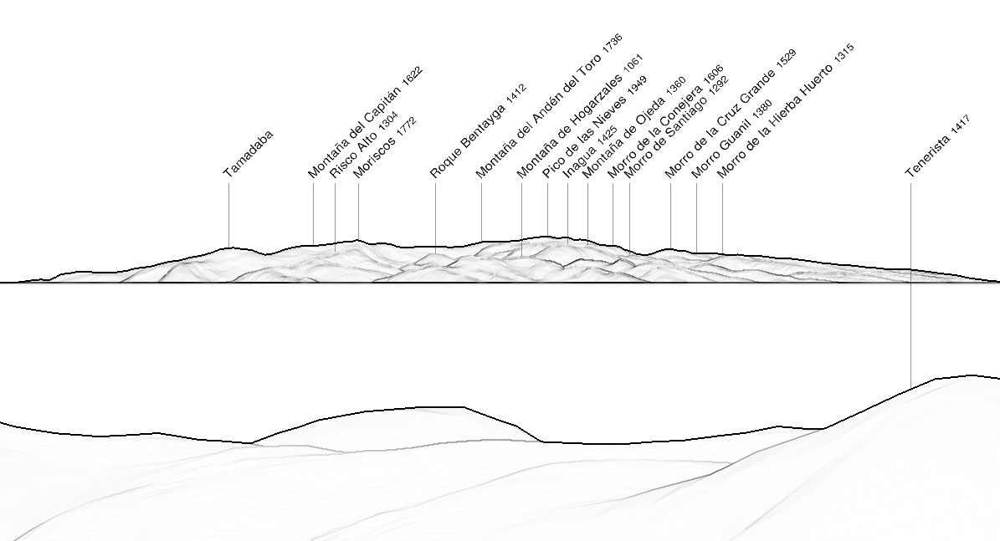
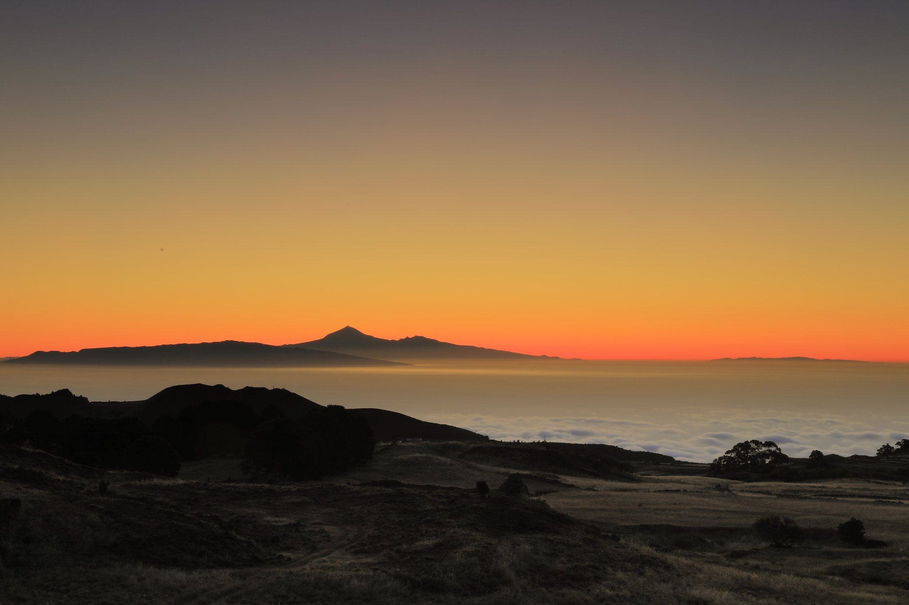

It is not easy to find pictures of Gran Canaria taken from El Hierro. 
In addition to the relatively long distance separating the two islands, one also has to consider that there are fewer people going on the summit of El Hierro to take pictures than people going to the summit of Gran Canaria.

The panorama simulation reveals that Gran Canaria is visible, though a good camera lens is needed for a good picture.

|  |
|:--:| 
| _Simulated view from Pico de Malpaso (1501 m) with https://www.peakfinder.org._ |

## Photographers

### Iván León Santiago

This was the first time I saw Gran Canaria from El Hierro in a picture. Here we can see La Gomera, Tenerife, and in the right-hand side, the silhouette of Gran Canaria. 

|  |
| :--: |
| ©  Iván León Santiago <i class="fa-brands fa-square-twitter"></i> https://twitter.com/ivanlesa https://www.instagram.com/ivanls | 

