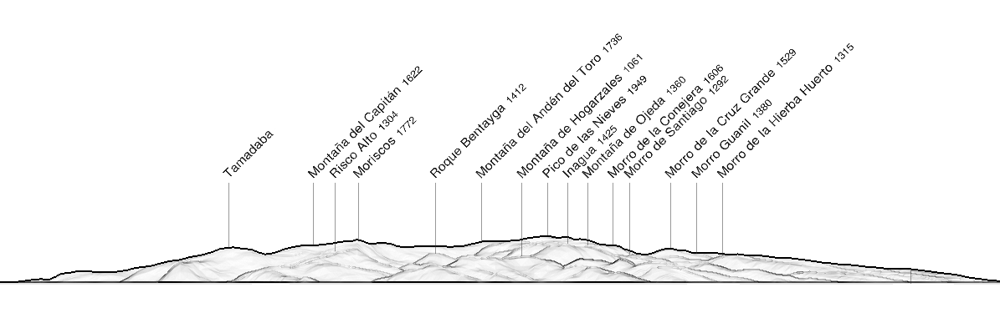

It is not easy to find pictures of Gran Canaria taken from El Hierro. 
In addition to the relatively long distance (more than 200 km) separating the two islands, one also has to consider that there are fewer people going on the summit of El Hierro to take pictures than people going to the summit of Gran Canaria.

## Panorama

The panorama simulation reveals that a large part of Gran Canaria is visible, though a good camera lens is needed for a good picture. 

|  |
|:--:| 
| _Simulated view from Pico de Malpaso (1501 m) with https://www.peakfinder.org._ |

## Photographers

Very few pictures have been found so far...

### Iván León Santiago

This was the first time I saw Gran Canaria from El Hierro in a picture. Here we can see, from left to right: 
- La Gomera (89 km from summit to summit) , 
- Tenerife, partly hidden by la Gomera and
- Gran Canaria, with only its highest part visible (due to altitude of the photographer: 1200 m).

|  |
| :--: |
| ©  Iván León Santiago • https://twitter.com/ivanlesa • https://www.instagram.com/ivanls | 

Other pictures with a longer focal length are also provided by the same photographer 👏:

