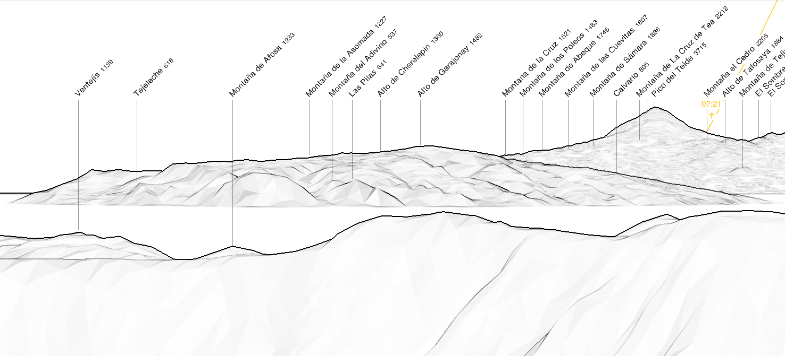
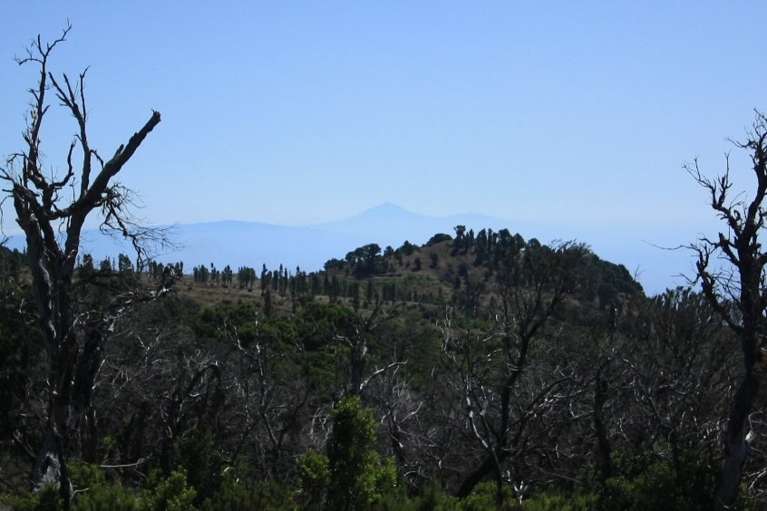

The 2 islands are relatively close, making the observation possible from several locations.

## Panorama

All the island of La Gomera can be seen from El Hierro summit. 

|  |
|:--:| 
| _Simulated view from el Pico de Malpaso (1501 m) with https://www.peakfinder.org._ |

## Pictures

|  |
| :--: |
| La Gomera and Tenerife seen from La Llanía. | 
