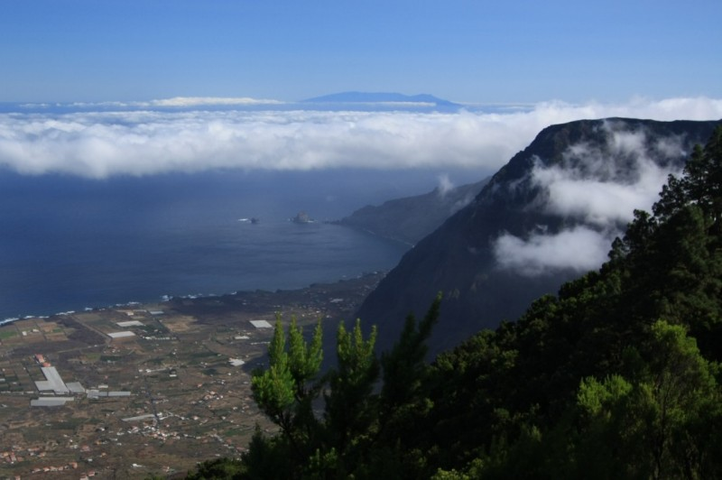

With a minimum distance shorter than 70 kilometers (between el Faro de Fuencaliente and Charco Manso), El Hierro and La Palma are sufficiently close to guarantee frequent observations from one to the other. 

## Panorama

Both Cumbre Viaja and Cumbre Nueva ridges are visible from El Hierro. 

|  |
| :--: | 
| _Simulated view from Pico de Malpaso (1501 m) with https://www.peakfinder.org._ |

## Pictures

|  |
| :--: | 
| _La Palma from the Golfo area._ |

