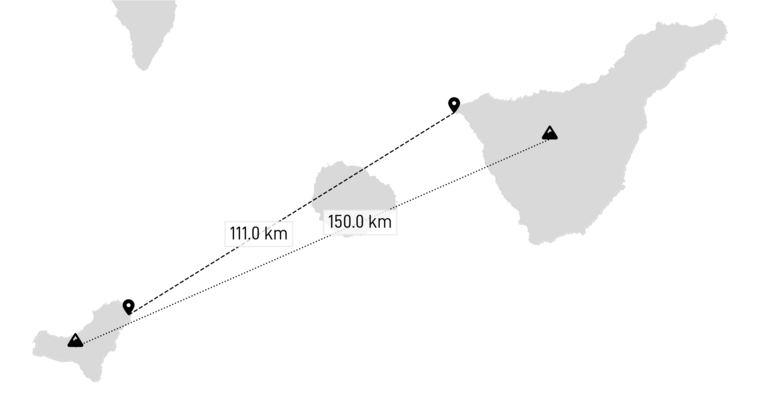

With more than 110 km between the two islands, the observation is not always possible.  

 
## Panorama

The northern part of Tenerife is hidden by La Gomera. 

|  |
| :--: | 
| _Simulated view from Pico de Malpaso (1501 m) with https://www.peakfinder.org._ |

## Pictures

