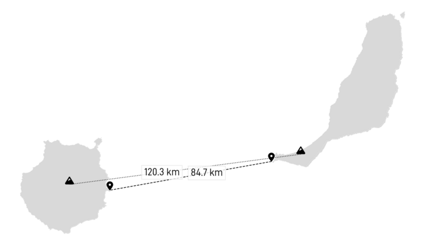
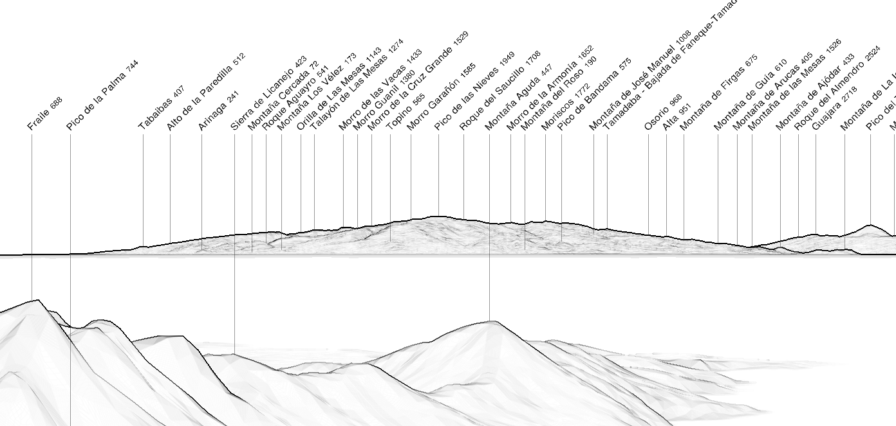

## Panorama

|  |
|:--:| 
| _Simulated view from Pico de la Zarza (807 m) with https://www.peakfinder.org._ |

## Photographers

Given that most of the pictures that show Gran Canaria also show Tenerife, the list is the same as [Tenerife seen from Fuerteventura](../tenerife/)

### DaniTSpotter


### Javi F.


### CaptainMarcinRX


### Pedro López Batista

You can also find some great pictures in Pedro's Flickr account:
https://www.flickr.com/photos/10570319@N08/46115021082/

### Juances
https://www.flickr.com/photos/juances/22681286536
