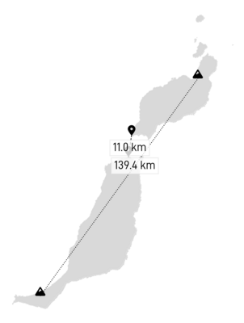

Fuerteventura and Lanzarote are the closest islands, with 11 km separating them in the Bocaina Strait (if we don't consider Lobos island, which belongs to Fuerteventura). Seeing one from the other is then very frequent and it is the opposite situation which turns out to be the rare.

## Panorama

Lanzarote is also visible from the southern part of Fuerteventura. According to the panorama simulation, the farthest visible point from the Pico de la Zarza is the Caldera Blanca, located in the Timanfaya National Park, 120 km away.

|  |
|:--:| 
| _Simulated view from Pico de la Zarza (807 m) with https://www.udeuschle.de._ |

