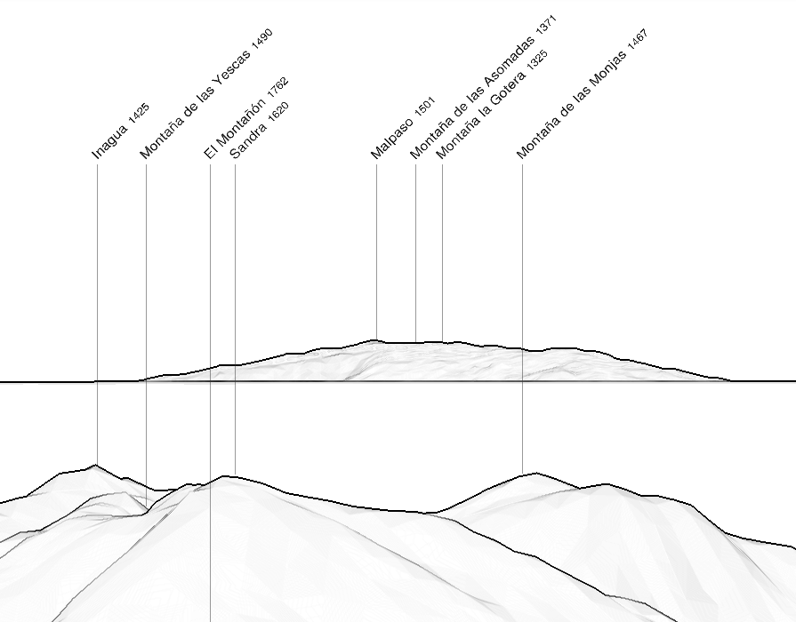

- Shortest distance: 228.1 km
- Distance between summits: 244.1 km

El Hierro is located at about 240 km from Gran Canaria, with an altitude similar to La Gomera.    
When La Gomera is visible, then there is a chance El Hierro also is: you need to look for it to the left of La Gomera and cross your fingers.

In order to tell the difference with clouds, it is useful to know the shape of the island, and also behing which montains of Gran Canaria it is located (around Inagua).

|  | 
|:--:| 
| El Hierro from Gran Canaria, simulation from https://www.peakfinder.org |

## Photographers

Plenty of pictures are available on social media, most of them taken at sunset, but not always!

### Juan Antonio Rico


### Mr Vivar


### Adrián Díaz


### Carlos Solinis Camalich


### José Manuel Caballero Fernández



### Myself 


