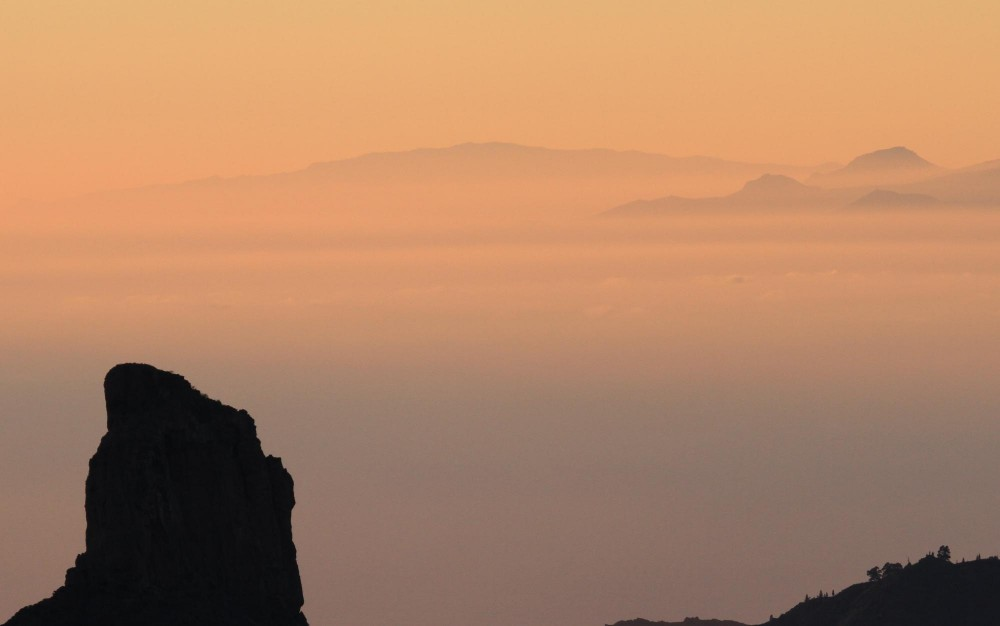
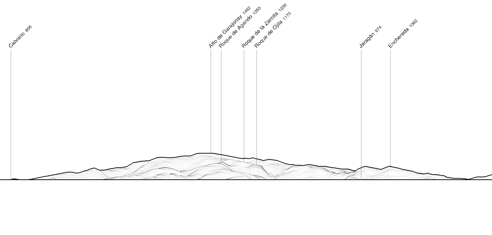

Vista desde el centro de Gran Canaria center, La Gomera aparece parcialmente tapada por el sur de Tenerife, a veces haciendo dificil ver que son dos islas distintas.

|  |
| :--: |
| Panorama simulado desde el Pico de las Nieves with https://www.peakfinder.org. |

Desde el suroest, la separación entre las islas es más clara, aunque las fotos de esta zona son menos frecuentes.

|  |
| :--: |
| Panorama simulado desde el suroest con https://www.peakfinder.org. |



## Fotografos

### Eduardo de la Cruz



### Elvira Olmo Guillen



