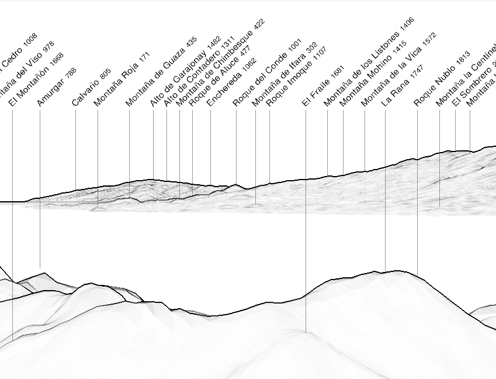
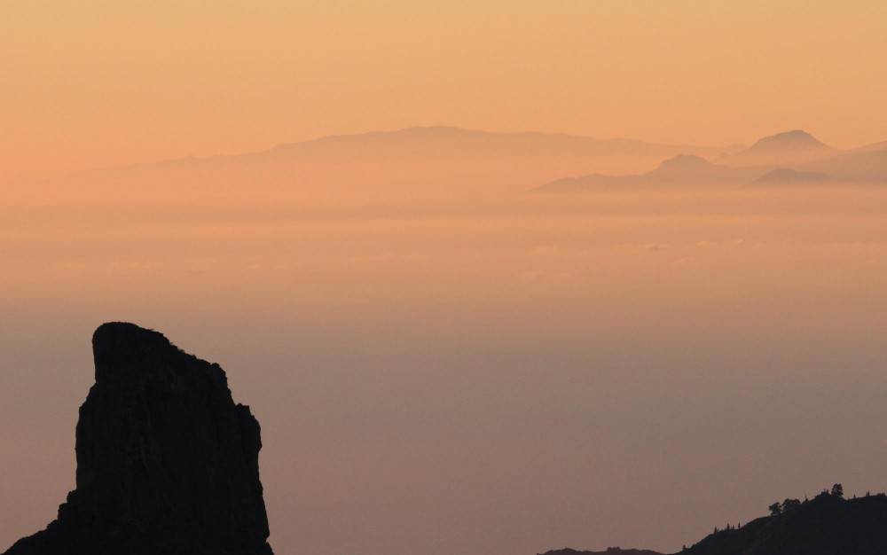
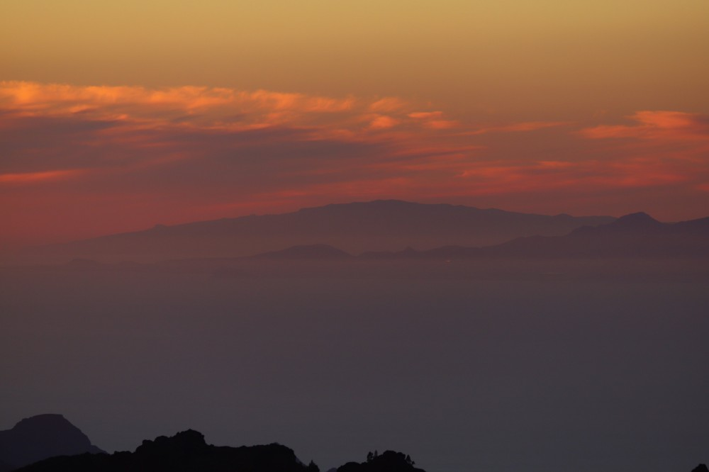
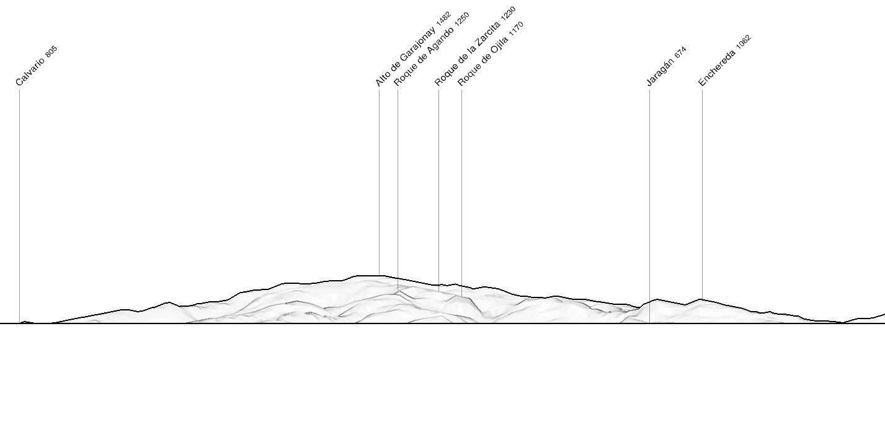

Seen from Gran Canaria center, La Gomera appears as partialy hidden behind the south of Tenerife, sometimes making it difficult they are in fact two different islands.
 
|  |
| :--: |
| Simulated panorama from Pico de las Nieves with https://www.peakfinder.org. |

From the southwestern coast, the separation is clearer as La Gomera appears almost separated from Tenerife.    
Pictures from that zone are less frequent.

|  |
| :--: |
| Simulated panorama from the southwest with https://www.peakfinder.org. |



## Photographers

### Eduardo de la Cruz



### Elvira Olmo Guillen



