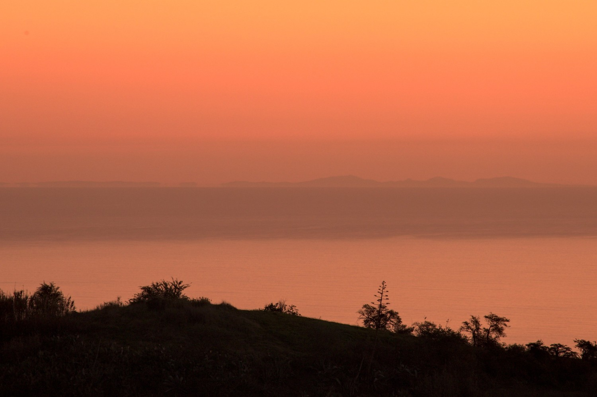

|  |
|:--:| 
| Lanzarote at sunrise, from Valleseco. | 

## Lanzarote or Fuerteventura?

You can frequently read and hear that Lanzarote is (easily) observable from Gran Canaria.
Yet most of the time, it is the northern or the cental part of Fuerteventura that is seen.
This island takes a wide portion of the horizon due to its length (more than 100 km).

|  | 
|:--:| 
| Lanzarote from Gran Canaria, simulation from https://www.udeuschle.de |

## What can be seen?

Lanzarote can be seen with the naked eye but you need to know where to look for it.     
With a teleobjective, you can get a picture showing 3 main summits located in the southern part of the island:
1. Atalaya de Femés (608 m),
2. Pico Redondo (551 m) and
3. Hacha Grande (561 m).

If the altitude allows it, then you can even see other peaks furthern north, up to the Caldera Blanca (460 m).    
The next pictures identifies some of the peaks of the island.

## What about la Graciosa?

Due to its position (north of Lanzarote) and its altitude (267 m), La Graciosa cannot be observed neither from Gran Canaria, nor from tenerife.

## Good locations

Most of the pictures shown here were taken from Valleseco, at an altitude of approximately 1100 m.
Other easily accessible view points include:
- Cruce de Ariñez (intersection of roads GC-230 and GC-400);
- Along the road from Cruz de Tejeda to Cruce de los Llanos (GC-150); 
- Montañón Negro.

