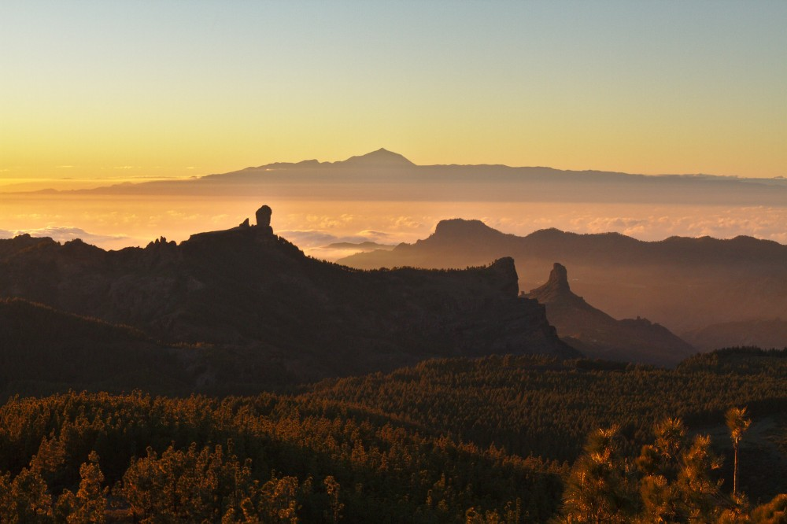
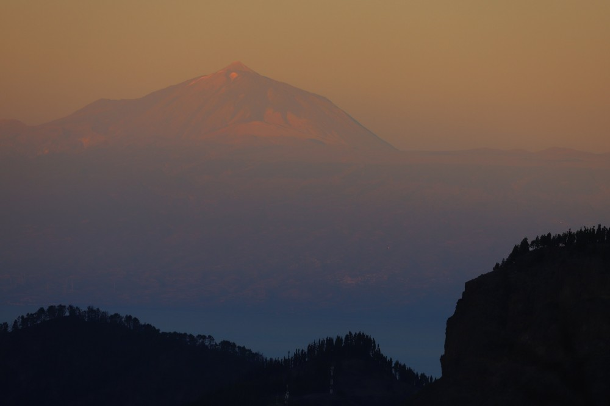
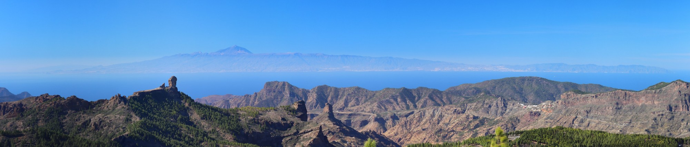

La silueta de Tenerife es parte del paisaje de Gran Canaria. Hay varios sitios desde donde se puede observar la isla, tanto por la cumbre (Pico de las Nieves, Cruz de Tejeda, ...) como por la costa (Puerto Mogán, Las Canteras...). 

|  |
| :--: |
| Panorama simulado desde el Pico de las Nieves a través https://www.peakfinder.org. |

Los atardeceres con Tenerife y el Teide en el fonda son entre los más bonitos, como mostrado por la numerosas personas que suben cada tarde a la cumbre de la isla para disfrutar del espectaculo.

Por la mañana, los colores salen mejor definidos ya que el sol queda detrás del observador.

## Panoramic pictures

Capturar toda la isla desde el norte haste el sur también resulta posible, pero require un objetivo gran angular o bien un programa para panorama ([hugin](https://hugin.sourceforge.io/) por ejemplo).

## Fotógrafos

### A. Castellano



### J. Marrero

Job nos suelo mostrar increíbles fotos del Teide con la Montaña de Gáldar en el fondo:



### MeteoSW



