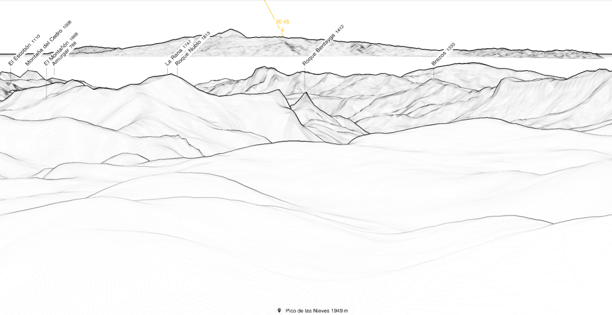
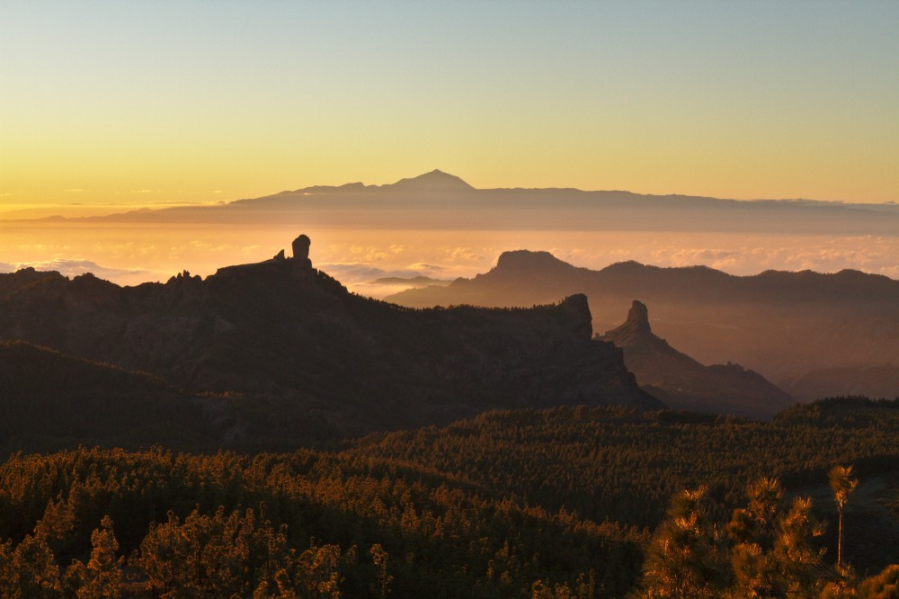
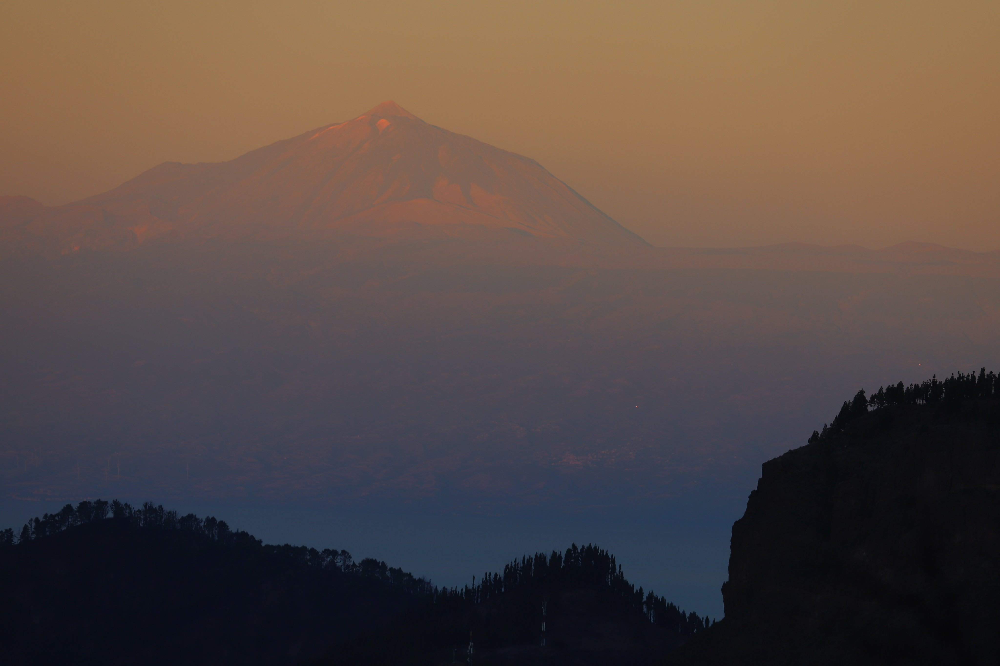
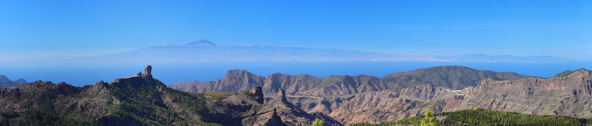
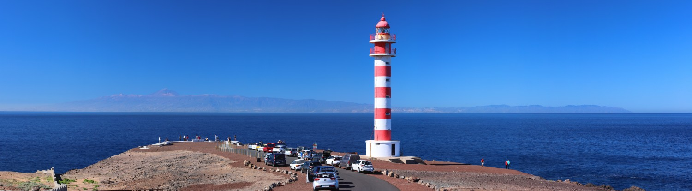

The silhouette of Tenerife is part of the landscape of Gran Canaria. There are numerous places from which to observe the island, not only from the island center (Pico de las Nieves, Cruz de Tejeda, ...) but also from the coastline (Puerto Mogán, Las Canteras...). 

|  |
| :--: |
| Simulated panorama from Pico de las Nieves with https://www.peakfinder.org. |

Sunsets with Tenerife and the Teide in the background are among the most spectacular, as shown by the numerous people who drive up to the island summit every evening to watch the spectacle.

In the morning, the colors are better defined as the sun is behind the observer. 

## Panoramic pictures

Capturing the whole island from north to south is also possible but might require a wide-angle lens or a panorama photo stitcher software ([hugin](https://hugin.sourceforge.io/) for example).

## Photographers

### A. Castellano



### J. Marrero

Job often shows us great pictures of the Teide with Montaña de Gáldar in the foreground:



