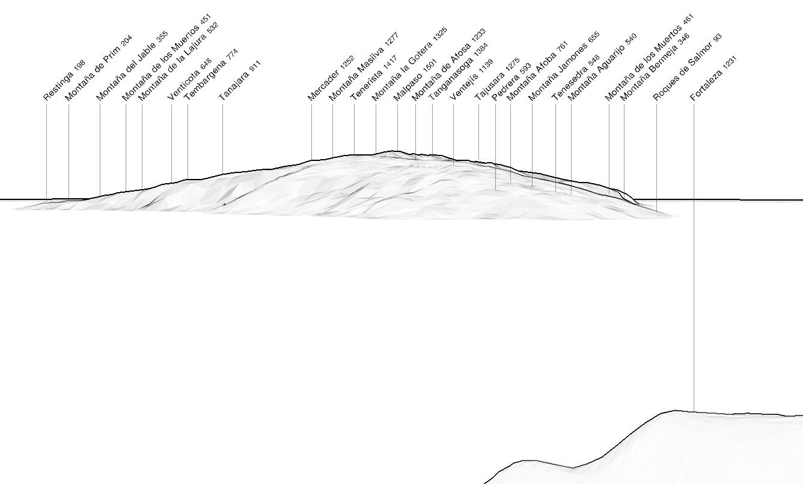

With the short distance between them (96 km), observing El Hierro from La Gomera is not too difficult.

|  |
| :--: |
| Simulated panorama from La Gomera with https://www.peakfinder.org. |

## Photographers

Finding pictures was not so easy...  

### Rubén Rodríguez
 

### Noreen Dalton
 
