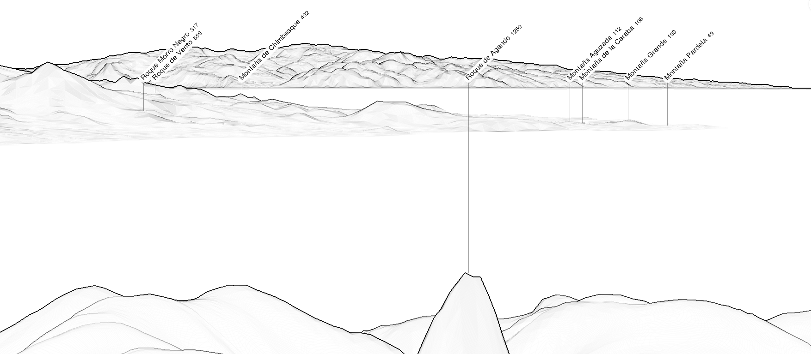

Gran Canaria is almost visible totally, except the northern part which is hidden by Tenerife.

|  |
| :--: |
| Simulated panorama from La Gomera with https://www.peakfinder.org. |

## Photographers

Finding pictures for these 2 islands is not easy...

### Rubén Rodríguez
 


### Juan A. Roja

https://www.flickr.com/photos/50193974@N05/8063854240
