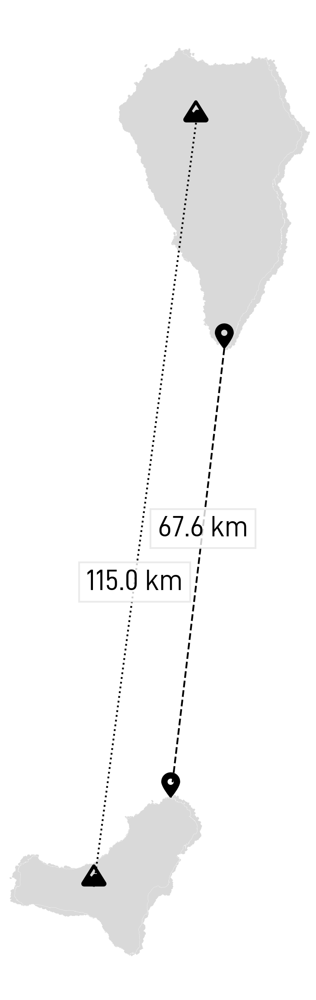
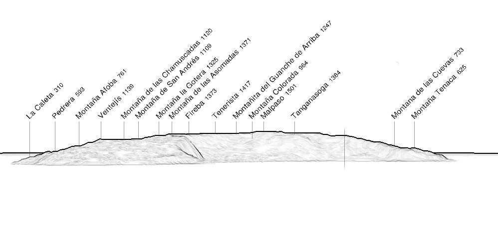
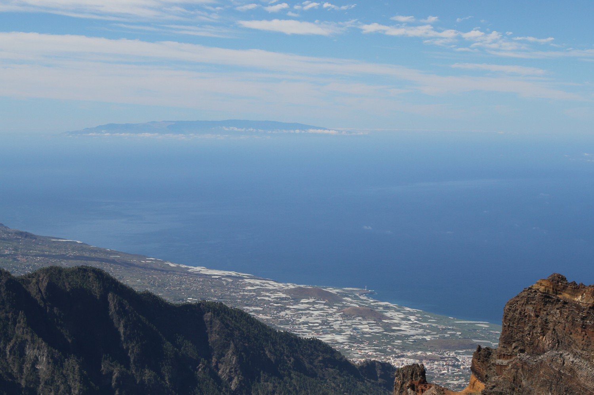

The two islands are relatively close (less than 70 km), making the observation easy in the absence of clouds.

 
## Panorama

From the La Palma summit, one faces _El Golfo_ area and the highest parts of the island. 

|  |
| :--: | 
| _Simulated view from El Roque de los Muchachos (2426 m) with https://www.peakfinder.org._ |

## Pictures

|  |

