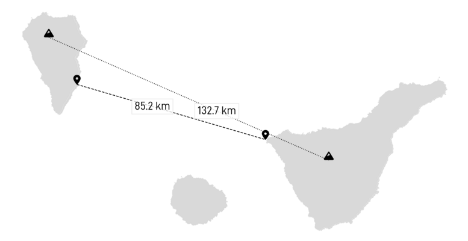
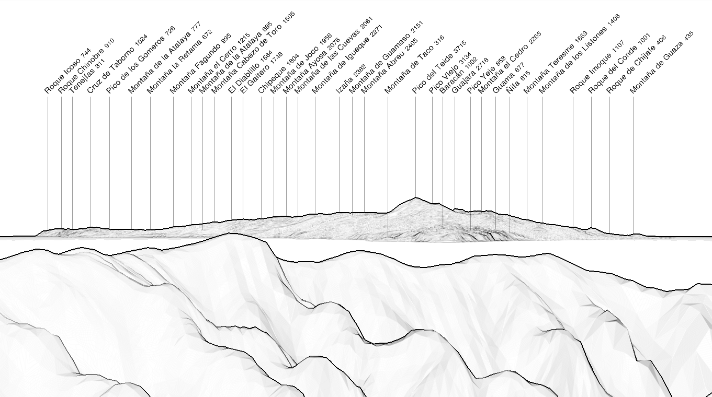
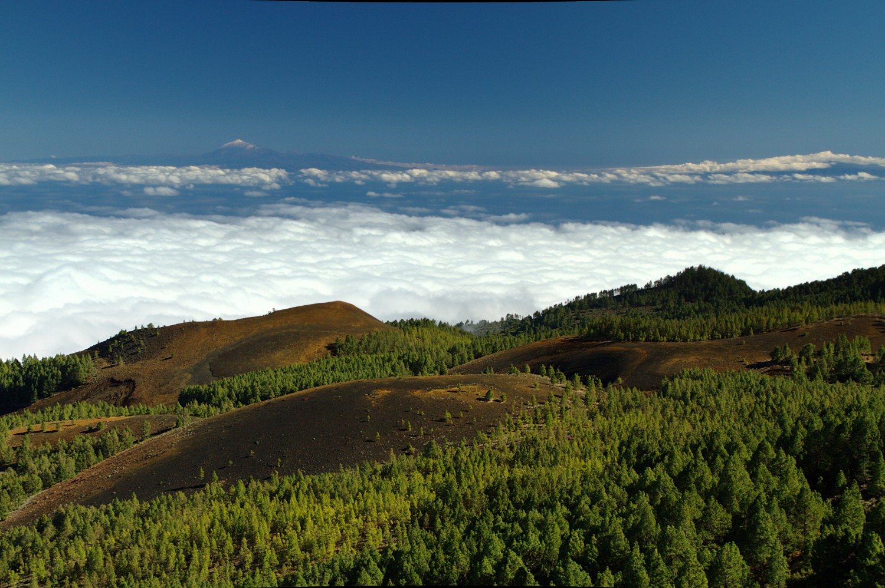
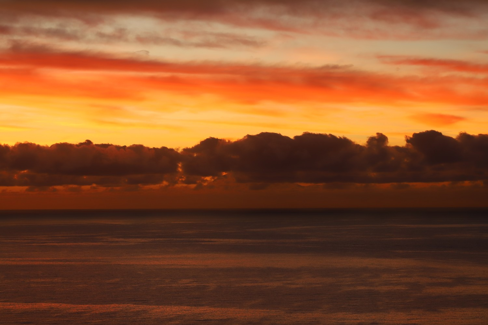
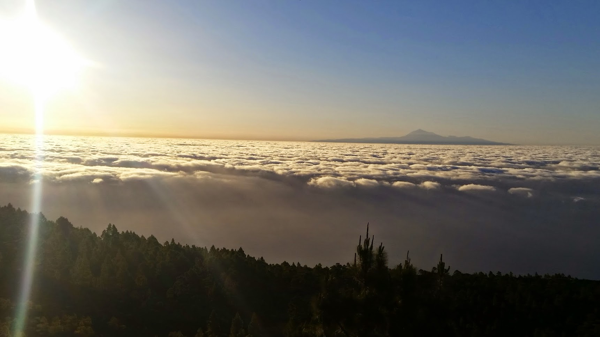
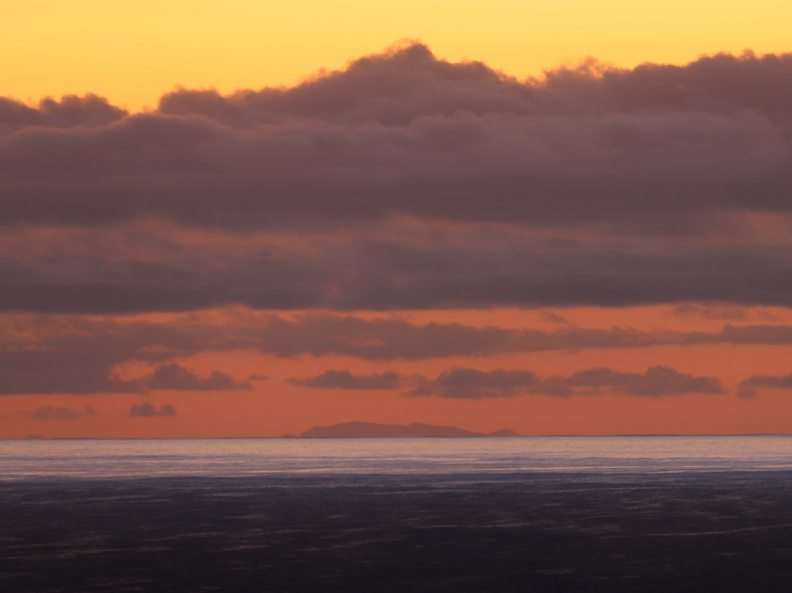

## Panorama

Tenerife is visible from north to south when observed from the top of La Palma. What is interesting is when the observations is closer to sea level, Tenerife appears to be separated into two different islands.

|  |
| :--: | 
| _Simulated view from El Roque de los Muchachos (2426 m) with https://www.peakfinder.org._ |

## Pictures

 |
| :--: | 
| _Tenerife with some snow on the Teide, from a location near Pico Birigoyo._ |

 |
| :--: | 
| _El Teide partly hidden by a cloud layer, seen from Santa Cruz de La Palma._ |

 |
| :--: | 
| _El Teide above the cloud layer, seen from La Ruta de los Volcanes._ |

 |
| :--: | 
| _The northern part of Tenerife from Santa Cruz de La Palma._ |

## Photographs

### Juanjo

In May 2024, Juanjo enjoyed excellent visibility conditions to create this amazing pictures of the Teide.

