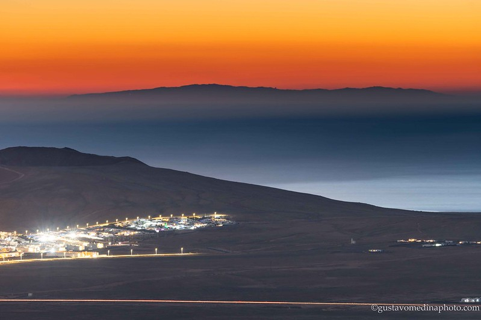

According to the panorama simulations, a large portion of Gran Canaria can be seen from Lanzarote (in this case from _los Ajaches_, in the southern part of the island). Due to the more than 200 km separating the islands, excellent atmospheric conditions are required.

## Photographers

### Juan José Cordero Valeriano
 

### Gustavo Medina

https://www.flickr.com/photos/121856779@N03/51821629913     

