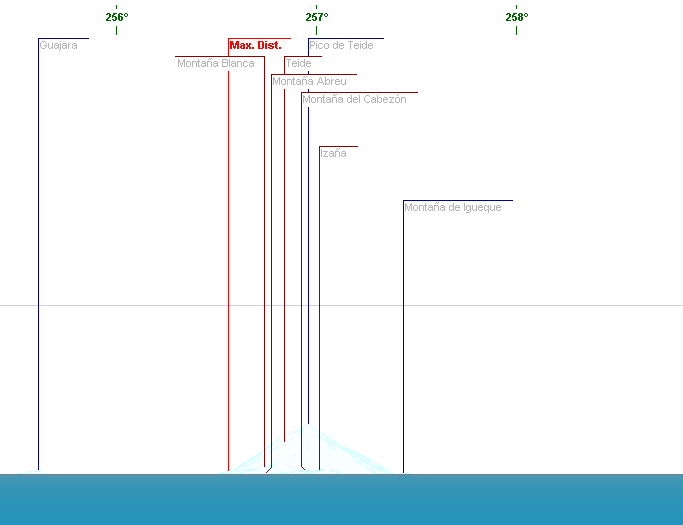

Capture the Teide from Lanzarote is probably one of the most challenging pictures for those interested in distance photography, as it is only possible a few times a year.

## Photographers

### J.J. Cordero

J.J. Cordero often publishes such pictures, for example this one taken on 1 May 2023: 


#### Other examples from Xuancor
* https://twitter.com/Xuancor/status/1531041956658397185 [30 May 2022]
* https://twitter.com/Xuancor/status/1477402753035087876 [1 January 2022]
* https://twitter.com/Xuancor/status/1066447987784732677 [24 November 2018]

### Gustavo Medina

Gustavo Medina is also famous for his amazing pictures of Lanzarote landscapes.    
Check out his [Instagram](https://www.instagram.com/gustavomedinaphoto) or his personal webpage: www.gustavomedinaphoto.com.

Here he captured the Teide in January 2022:


### rafaelsanexp



## In the news

Local newpapers sometimes write about this rare events:

* https://www.laprovincia.es/lanzarote/2023/03/09/fotografia-mas-impresionante-emotiva-teide-visto-desde-lanzarote-dv-84351327.html
* https://diariodeavisos.elespanol.com/2019/01/el-teide-en-cinco-fotos-que-arrasaron-este-ano/

